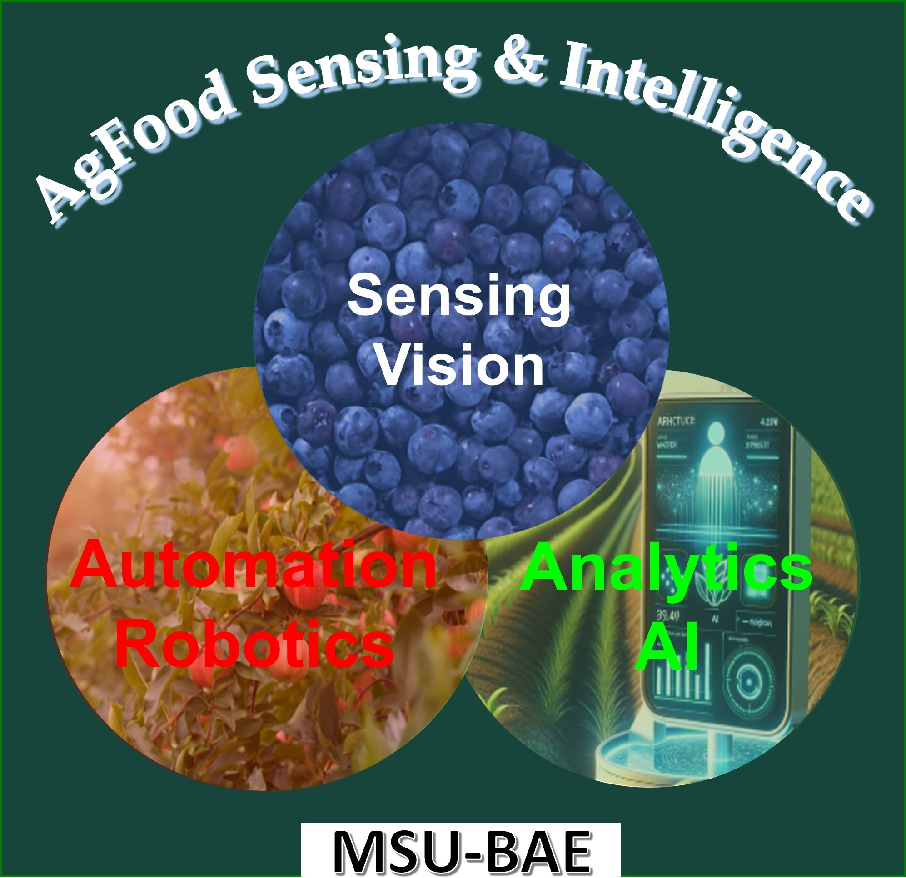

  

# AgFoodSensing & Intelligence Lab — Michigan State University

> We innovate in **non-destructive sensing** (machine vision, optical imaging, spectroscopy) and **automation/robotics** powered by **AI** for smart and sustainable agriculture and food systems.

---

## 🔭 Overview

Founded by **Dr. Yuzhen Lu**, Assistant Professor in the Department of **Biosystems & Agricultural Engineering (BAE)** at **Michigan State University**, the AgFoodSensing & Intelligence Lab focuses on developing cutting-edge sensing and intelligent systems to improve productivity, quality, and sustainability in agriculture and food industries.

Our work spans **optical sensing**, **machine vision**, **precision agriculture**, **food inspection**, **plant/animal phenotyping**, and **AI-driven automation**.

---

## 👩‍🔬 Principal Investigator

**Dr. Yuzhen Lu**
Assistant Professor, Department of Biosystems & Agricultural Engineering, Michigan State University
📧 [luyuzhen@msu.edu](mailto:luyuzhen@msu.edu)
🌐 [www.yuzhenlu.com](https://www.yuzhenlu.com)

Dr. Lu previously served as an Assistant Professor at Mississippi State University and conducted postdoctoral research with the USDA-ARS at MSU, focusing on optical imaging for horticultural quality and in-field machine vision for apple sorting. His research integrates engineering, imaging, and AI for practical agricultural automation solutions.

---

## 🧠 Research Interests

* Optical Sensing & Imaging (HSI, SIRI, Multispectral)
* Machine Vision & Deep Learning
* Precision Agriculture & Robotics
* Food Inspection & Quality Evaluation
* High-throughput Plant & Animal Phenotyping
* Automation and AI for Specialty Crops

---

## 🧩 Team Structure

**Postdoctoral Researchers:** Naseeb Singh, Xinyang Mu
**Graduate Assistants:** Ashfak Yeafi, Boyang Deng, Jiaming Zhang, Khairul Islam, Mehedi Hasan, Shraddha Kiran Burra, Yuyuan Tian
**Undergraduate Researchers:** Arnav Gupta, Christina Lin, Gracie Cockerham, Joseph Coker, Sagar Kikkeri, Sidhaant Bhatt, Timothy Usey
**Alumni:** Jiajun Xu, Yibin Wang, Jiaxu Cai, Shuochong Zeng, Ebenezer Olaniyi, Krishna Ginne, Mingjun Li

---

## 🧪 Active Projects

| Year      | Project                                          | Funding                          |
| --------- | ------------------------------------------------ | -------------------------------- |
| 2025-2029 | **AI for Asparagus Grading & Sorting**           | USDA-NIFA-AFRI ($591,499)        |
| 2025-2027 | **Blue-Dynamo (Blueberry Rot Detection)**        | USDA-SCRI ($3.95M)               |
| 2025-2027 | **Catfish Fillet Automation (IQF)**              | USDA-AFRI ($300K)                |
| 2025-2026 | **Cherry Pit Detection via Deep Tissue Imaging** | Michigan Cherry Committee ($25K) |
| 2024-2026 | **AI-based Robotic Weeding**                     | USDA-AMS-SCBGP/MDARD ($100K)     |
| 2023-2027 | **Autonomous Apple Sorting & Harvesting System** | USDA-SCRI ($3.53M)               |
| 2023-2025 | **Poultry Quality via Light Scattering Imaging** | M-AAA ($146K)                    |
| 2022-2026 | **Optical Quality Evaluation for Sweetpotatoes** | USDA-AMS-SCMP ($750K)            |

> Full project descriptions and collaborators are available on the [Projects Page](https://www.yuzhenlu.com/#projects).

---

## 📚 Selected Publications (2024–2025)

* **Naseeb Singh, Y. Lu (2025)** – Non-destructive Detection of Pits in Cherries using Shortwave Infrared Hyperspectral Transmittance Imaging, *Postharvest Biology & Technology* (submitted)
* **Boyang Deng, Y. Lu (2025)** – Weed Image Augmentation by ControlNet-Added Stable Diffusion, *Computers and Electronics in Agriculture*
* **Jiaming Zhang, Y. Lu (2025)** – 3D Laser Profiling for Real-Time Woody Breast Detection, *Journal of Food Engineering*
* **Jiajun Xu, Y. Lu (2025)** – 3D Vision-based Asparagus Perception for Selective Harvesting, *Journal of the ASABE*
* **Anil Bhujel et al., Y. Lu (2024)** – Systematic Survey of Vision Datasets for Precision Livestock Farming, *Computers and Electronics in Agriculture*
* **Boyang Deng, Y. Lu (2024)** – YOLOv9 for Blueberry Detection, *Smart Agricultural Technology*

> See the [Publications Page](https://www.yuzhenlu.com/#publications) for a full list.

---

## 📰 News Highlights

* 🧩 *Oct 2025:* MSU Discretionary Funding Initiative grant ($50K) for innovative poultry imaging.
* 🌍 *Sep 2025:* Recognized among *World Top 2% Scientists* by Stanford & Elsevier.
* 🧠 *Sep 2025:* USDA-NIFA grant awarded for Asparagus Automation — PhD/MS openings available.
* 🏆 *Sep 2025:* Boyang Deng awarded the BAE Graduate Scholarship ($2,000).

---

## 🎓 Open Positions

We are recruiting **PhD/MS students** and **Postdocs** (Spring/Fall 2026) in:

* Optical and Hyperspectral Imaging
* AI & Machine Vision for Agriculture
* Robotics and Automation Systems

📧 Contact **[luyuzhen@msu.edu](mailto:luyuzhen@msu.edu)** with your CV and research interests.
See details on the [Openings Page](https://www.yuzhenlu.com/#openings).

---

## 📬 Contact

**AgFoodSensing & Intelligence Lab**
524 S. Shaw Ln, 211 Farrall Hall
Michigan State University, East Lansing, MI 48824
📧 [luyuzhen@msu.edu](mailto:luyuzhen@msu.edu)
📞 517-353-4517
🌐 [yuzhenlu.com](https://www.yuzhenlu.com)

---

### Acknowledgment

If using lab tools or data, cite appropriately and credit collaborators.

---

© 2025 AgFoodSensing & Intelligence Lab — Michigan State University

